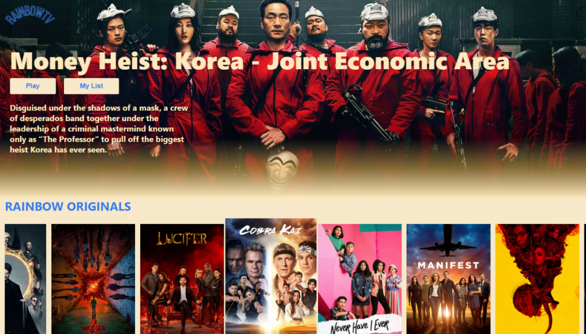
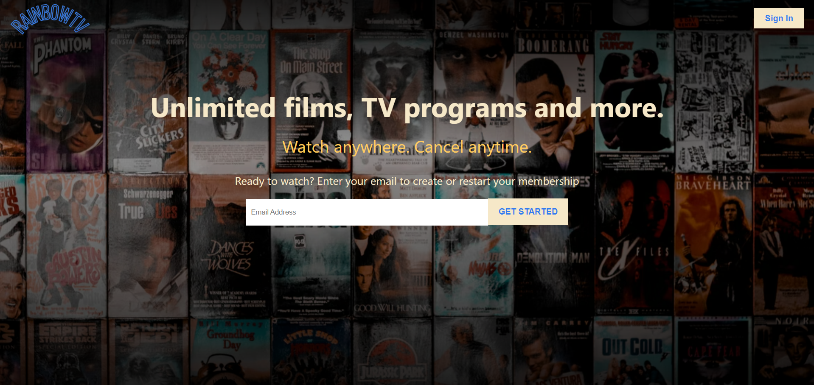
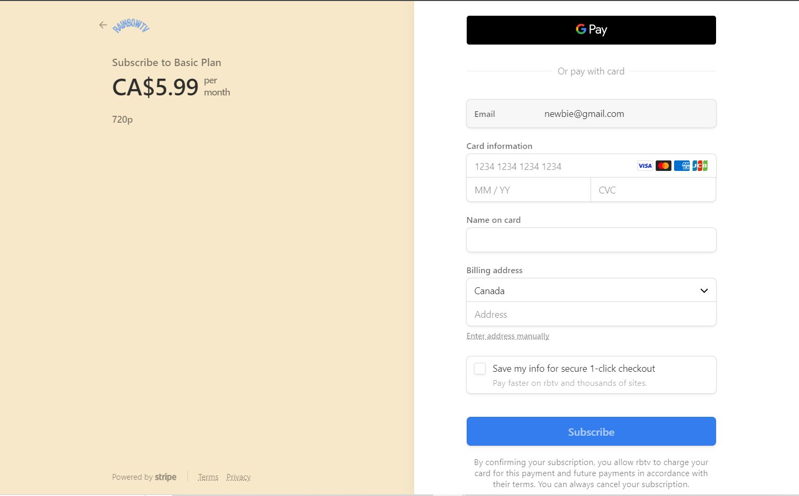

# RainbowTV





> Stream anytime you want, anywhere you like. RainbowTV is created with React, Redux, firebase and stripe integration. Pulling live data from TMDB movie database for your wide range of tastes.
---


* [Description](#general-info)
* [How to use](#how-to-use)
* [Technologies](#technologies)
* [References](#references)
* [Contents](#contents)
* [Contributors](#contributors)
---


## Description
Stream anytime you want, anywhere you like. RainbowTV is created with React, Redux, firebase and stripe integration. Pulling live data from TMDB movie database for your wide range of tastes.

---

## How-to-use
https://rainbow-tv-5ce1e.web.app/

---
## Technologies
This project is built with:
* HTML/CSS/Javascript
* React/Redux/Firestore stripe integration
* TMDB API
---

## References
- Banner/logo: made with canva.com
- Icons: font awesome 5.14
- Tutorials followed in the making of this project: 
    - https://www.youtube.com/c/SonnySangha

---	
## Contents
Content of the project folder:

```
 Top level of project folder: 
├── .gitignore               # Git ignore file
├── index.html               
└── README.md

It has the following subfolders and files:
├── rainbow-tv
└── .firebase
└── build
└── public
└── src            


```
---
## Contributors
* Hairun Huang (hairunhuang@Gmail.com)

---
**Version 1.0.0**
[Back to the top](#general-info)

